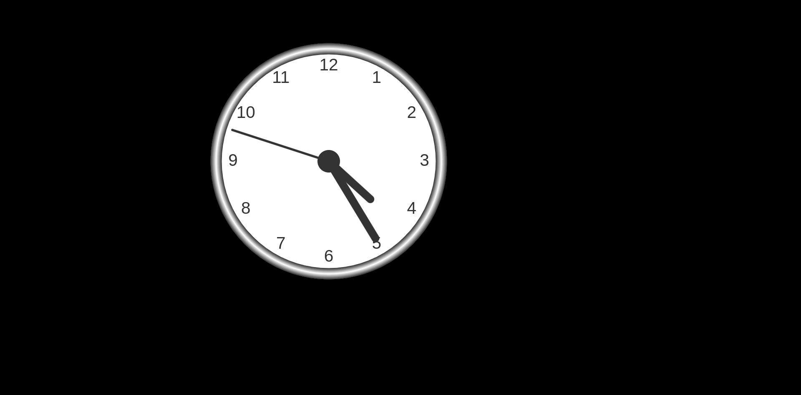

# JavaScript_Projects

## Analog_Clock
- 

## BMI_Calculator
- 

## Background_Image_Slider
- 

## Coin_Toss_Game
- 

## Color Change
- 

## Digital_Clock
- 

## Height_Converter
- 

## LightBulb_On_Off
- 

## Whack_a_Mole
- 
